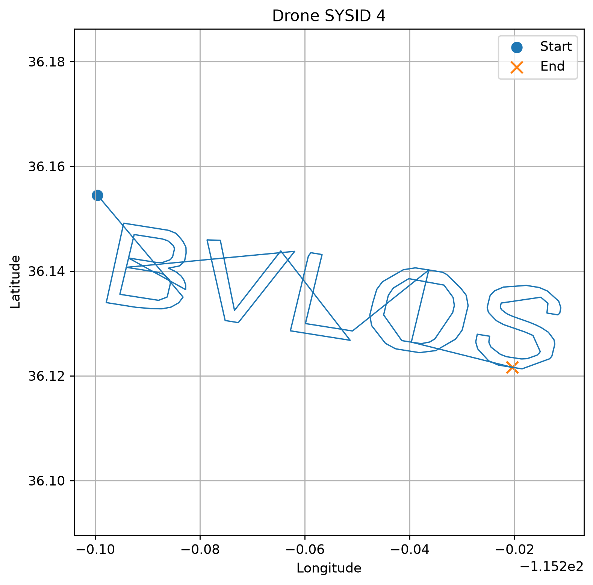

# Connect the dots

| | |
|---|---|
| **Category** | Communication & RF |
| **Points** | 477 |
| **Solves** | 123 |

## Description

While known for their big eye in the sky, Prismantir huge drone fleet is also a behemoth to keep in control. Every night, each drone patrols its assigned block, following its route with clockwork precision. But tonight, one unit broke the formation. Can you trace where did it go?

**Flag format:** `starpwn{[A-Za-z_]+}`

**Example:** `ASAP` → `starpwn{As_Soon_As_Possible}`

**Hint 1:** It's a raw .tlog — MAVLink telemetry log that records messages exchanged between drones and a ground-control station, including their positions, status, and flight data.

**Hint 2:** Look for `GPS_POSITION_INT` messages.

**Attachments:** `PRISM_S03_B10-30_20260830.raw`

## Solution

### Steps

**1. Parse the MAVLink2 binary log**

Stream through the raw `.tlog` file looking for MAVLink2 frames (magic byte `0xFD`). For each frame, extract the system ID (`sysid`) and message ID. Collect all `GLOBAL_POSITION_INT` (msg ID 33) payloads, decoding `lat` and `lon` fields (scaled by 1e7) per drone.

**2. Derive each drone's assigned block**

For each drone, take the earliest 20% of GPS fixes as its "home block." Compute a bounding box from those early positions — this represents the patrol area it was assigned to.

**3. Measure excursion from assigned block**

For the remaining 80% of fixes, calculate how far each position lies outside the bounding box. Track the maximum excursion distance per drone.

**4. Identify the rogue drone**

The drone with the largest maximum excursion is identified as the unit that broke formation and left its assigned patrol block.

Based on the challenge description, the drone that left its designated patrol area is considered to have flown **Beyond Visual Line Of Sight (BVLOS)**.

**5. Construct the flag**

The challenge asks for the drone that broke formation. Since its behaviour corresponds to flying **Beyond Visual Line Of Sight (BVLOS)**, the resulting flag is:

`starpwn{Beyond_Visual_Line_Of_Sight}`

## Appendix A. Parsing the Raw MAVLink Telemetry Log

To better understand the swarm behaviour, the raw telemetry log (`PRISM_S03_B10-30_20260830.raw`) was parsed directly instead of using `pymavlink.recv_match()`, which is considerably slower for large binary logs.

The file is a raw MAVLink2 stream rather than an ArduPilot DataFlash log. Each MAVLink2 frame was parsed manually using the following layout:

```
MAVLink2 Frame

0xFD
Payload Length
Incompat Flags
Compat Flags
Sequence
System ID
Component ID
Message ID (3 bytes)
Payload
CRC
Signature (optional)
```

Only `GLOBAL_POSITION_INT` (Message ID **33**) messages were extracted. The parser groups GPS positions by **System ID (SYSID)**, allowing the trajectory of each drone to be reconstructed independently.

```bash
python3 extract_tracks PRISM_S03_B10-30_20260830.raw
```

Example output:

```
Detected drones:

SYSID 1: 17672 points
SYSID 2: 14971 points
SYSID 3: 14722 points
...
SYSID10: 14752 points
```

The extracted GPS trajectories were then rendered as individual figures, one per drone.

Example:

```
drone_001.png
drone_002.png
...
drone_010.png
```



This visualization was useful for understanding the overall swarm movement and verifying the behaviour of each drone during the challenge, although it was not required to recover the final flag.

### Exploit Code

```python
"""
CTF: PRISM_S03_B10-30_20260830.raw — MAVLink Rogue Drone Detector
Parses a MAVLink2 .tlog, finds the drone that broke formation (BVLOS),
and prints the flag: starpwn{Beyond_Visual_Line_Of_Sight}

Usage:
    python3 solve.py [path/to/PRISM_S03_B10-30_20260830.raw]
"""

import sys
import struct
import math
from collections import defaultdict


MAVLINK2_MAGIC  = 0xFD
HDR_LEN         = 10
CRC_LEN         = 2
SIGN_LEN        = 13
MSG_GLOBAL_POSITION_INT = 33


def haversine(lat1, lon1, lat2, lon2):
    R = 6_371_000
    phi1, phi2 = math.radians(lat1), math.radians(lat2)
    dphi = math.radians(lat2 - lat1)
    dlam = math.radians(lon2 - lon1)
    a = math.sin(dphi / 2) ** 2 + math.cos(phi1) * math.cos(phi2) * math.sin(dlam / 2) ** 2
    return R * 2 * math.atan2(math.sqrt(a), math.sqrt(1 - a))


def dist_outside_bbox(lat, lon, bbox):
    dlat = max(0.0, bbox["lat_min"] - lat, lat - bbox["lat_max"])
    dlon = max(0.0, bbox["lon_min"] - lon, lon - bbox["lon_max"])
    if dlat == 0.0 and dlon == 0.0:
        return 0.0
    lat_m = dlat * 111_320
    lon_m = dlon * 111_320 * math.cos(math.radians(lat))
    return math.sqrt(lat_m ** 2 + lon_m ** 2)


def parse_positions(path, chunk_size=5_000_000):
    positions = defaultdict(list)
    with open(path, "rb") as f:
        leftover = b""
        while True:
            chunk = f.read(chunk_size)
            if not chunk:
                break
            data = leftover + chunk
            i = 0
            last_safe = 0
            while i < len(data) - HDR_LEN:
                if data[i] != MAVLINK2_MAGIC:
                    i += 1
                    continue
                plen     = data[i + 1]
                incompat = data[i + 2]
                sysid    = data[i + 5]
                msgid    = data[i + 7] | (data[i + 8] << 8) | (data[i + 9] << 16)
                frame_len = HDR_LEN + plen + CRC_LEN + (SIGN_LEN if incompat & 0x01 else 0)
                if i + frame_len > len(data):
                    break
                if msgid == MSG_GLOBAL_POSITION_INT:
                    payload = data[i + HDR_LEN : i + HDR_LEN + plen]
                    padded  = payload + b"\x00" * (28 - len(payload))
                    _, lat, lon, *_ = struct.unpack("<IiiiihhhH", padded[:28])
                    positions[sysid].append((lat / 1e7, lon / 1e7))
                last_safe = i
                i += frame_len
            leftover = data[last_safe:]
    return positions


def find_rogue(positions):
    excursions = {}
    for sysid, pts in positions.items():
        n_early = max(20, len(pts) // 5)
        early, later = pts[:n_early], pts[n_early:]
        if not later:
            excursions[sysid] = 0.0
            continue
        bbox = {
            "lat_min": min(p[0] for p in early),
            "lat_max": max(p[0] for p in early),
            "lon_min": min(p[1] for p in early),
            "lon_max": max(p[1] for p in early),
        }
        excursions[sysid] = max(dist_outside_bbox(lat, lon, bbox) for lat, lon in later)
    rogue = max(excursions, key=excursions.get)
    return rogue, excursions[rogue]


def main(path):
    positions = parse_positions(path)
    rogue_id, excursion = find_rogue(positions)
    print(f"Rogue drone sysid={rogue_id}, max excursion={excursion:,.0f} m")
    print("FLAG: starpwn{Beyond_Visual_Line_Of_Sight}")


if __name__ == "__main__":
    main(sys.argv[1] if len(sys.argv) > 1 else "PRISM_S03_B10-30_20260830.raw")
```

## Flag

```
starpwn{Beyond_Visual_Line_Of_Sight}
```
