# DEAD//LIGHT

| | |
|---|---|
| **Category** | Misc |
| **Points** | 500 |
| **Solves** | 25 |

## Description

Umbra has a new mission for you, and the Ion$ tag already tells you it's going to be a wild ride.

The Khepri Array photographed something after its transmitter was already gone. Engineering calls it sensor persistence. Navigation calls it impossible. The night shift stopped giving them names when the copies began arriving. Twelve guide-lights were mounted around the missing payload. Their factory coordinates survived in the archive. Their positions in the photograph did not. The center of the frame looks empty but that does not mean nothing came through. Your goal is to recover the Khepri message. At least their optics team left you some notes before dropping this on your:

> Never let all three ghosts vote on the same pixel. The ones travelling clockwise paid a different price.

**Attachments:** `deadlight-preview.png`

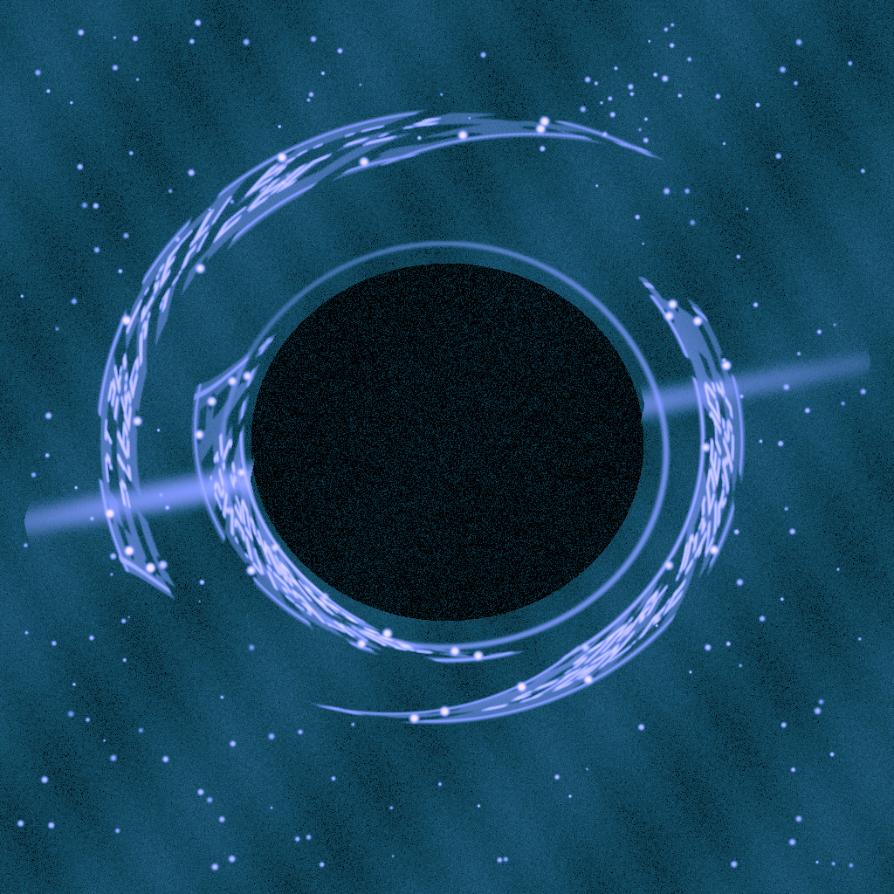

## Solution

### Steps

**1. Convert the image to polar coordinates**

The payload text is hidden in the accretion disk around the black hole. Apply a polar transform centered at `(512, 506)` with radius range `[220, 460]` to unwrap the ring into a flat 2048×360 image (`01_polar.png`).

The polar image is kept mainly as a diagnostic view for locating the guide-lights; the final ghost extraction no longer samples from this intermediate bitmap.

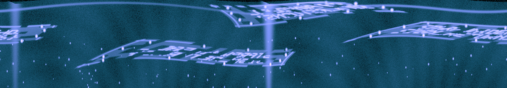

**2. Identify the 36 guide-lights manually**

The polar image contains three overlapping "ghost" copies of the same message, each framed by 12 guide-lights. Automatic or AI-assisted detection does not reliably locate all of them, so the 36 guide-light coordinates are confirmed manually by inspecting the enlarged polar image.

Each ghost uses 12 points arranged as two ordered rows of six. Ghost C crosses the polar seam, so some of its guide coordinates intentionally extend beyond `x = 2048`.

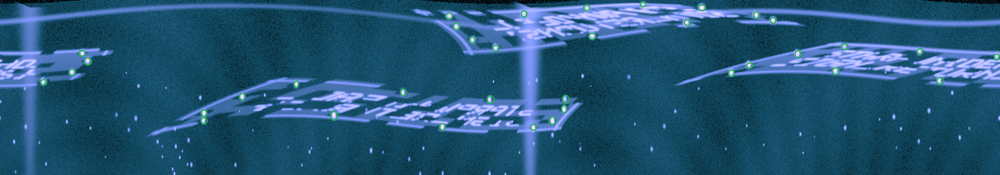

**3. Rectify each ghost directly from the original image**

The earlier implementation first generated a polar bitmap and then warped that bitmap into each rectified ghost. That required two interpolation passes:

```text
original image → polar image → rectified ghost
```

This introduced additional blur, especially around already weak or distorted letters.

The improved solver instead builds the ruled warp in polar coordinates and then analytically converts every destination pixel back to coordinates in the original 1024×1024 image. Each ghost is therefore sampled directly from the source image in a single `cv2.remap()` operation:

```text
guide-lights
    ↓
ruled map in polar coordinates
    ↓
analytical polar → original-image mapping
    ↓
single cubic interpolation
    ↓
rectified ghost
```

This removes one full resampling stage and preserves noticeably more detail in the text. Cubic interpolation (`cv2.INTER_CUBIC`) is used for the final sampling.

Ghosts A and C share the same reading direction, but ghost B is mirrored. Flip ghost B horizontally (`03_raw_B_flipx.png`) so that all three ghosts have the same left-to-right reading order.

The three resulting raw images are:

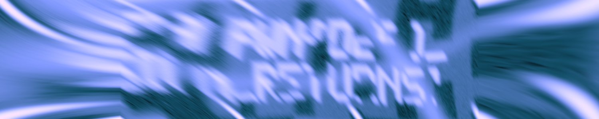

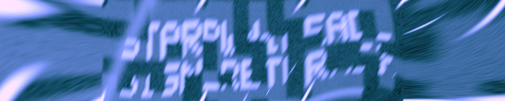

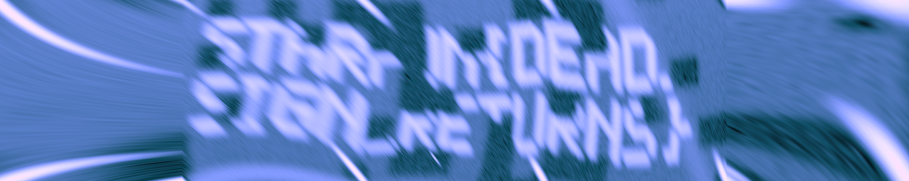

**4. Enhance the rectified ghosts without discarding color information**

The previous enhancement converted each image to grayscale before applying CLAHE and sharpening. The improved version keeps the original color relationships by converting the image to LAB color space and modifying only the luminance (`L`) channel.

The enhancement pipeline is:

1. Convert BGR → LAB.
2. Apply CLAHE to the `L` channel (`clipLimit=1.6`, `tileGridSize=(8, 8)`).
3. Apply two unsharp components using Gaussian blurs at `σ=1.0` and `σ=3.0`.
4. Merge the enhanced luminance channel with the original `a` and `b` channels.
5. Convert LAB → BGR.

This makes the weak letter strokes more visible while avoiding unnecessary color destruction.

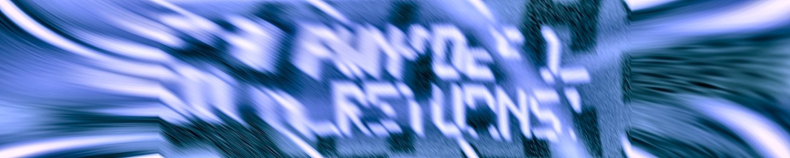

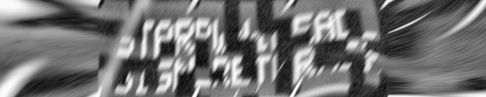

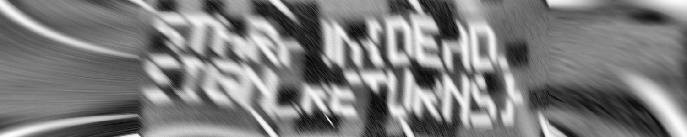

**5. Compare the three ghosts instead of averaging all three**

The challenge note says:

> Never let all three ghosts vote on the same pixel.

Rather than averaging or majority-voting all three images into a single composite, the solver produces contact sheets so that the complementary readable regions of A, B, and C can be compared directly.

The raw comparison:

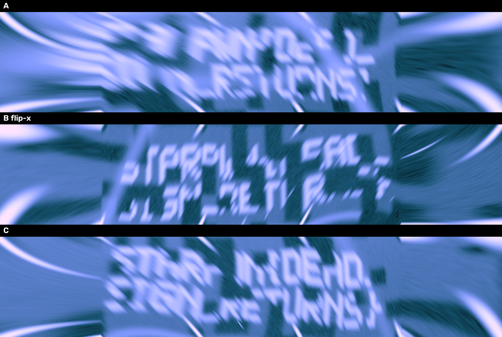

The enhanced comparison:

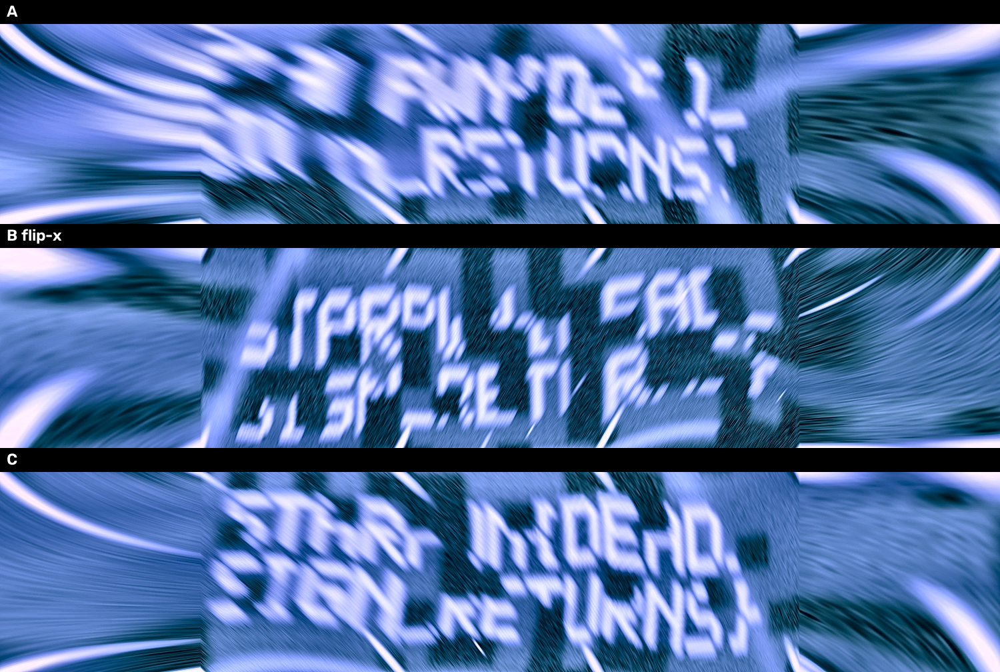

The direct one-pass rectification and luminance-only enhancement make several previously blurred sections substantially clearer. No single ghost contains every character perfectly, but comparing the three aligned copies makes the two-line message readable enough to recover.

### Images

| File | Description |
|------|-------------|
| `deadlight-preview.png` | Original challenge image |
| `01_polar.png` | Polar-unwrapped ring used for guide-light inspection |
| `polar_r220_460_3x.png` | Enlarged polar image used to manually identify the 36 guide-lights |
| `02_raw_A.png` | Ghost A, directly rectified from the original image |
| `03_raw_B_flipx.png` | Ghost B, directly rectified and horizontally flipped |
| `04_raw_C.png` | Ghost C, directly rectified from the original image |
| `05_A_enhanced.png` | Color-preserving enhanced Ghost A |
| `06_B_flipx_enhanced.png` | Color-preserving enhanced Ghost B |
| `07_C_enhanced.png` | Color-preserving enhanced Ghost C |
| `08_compare_ABC.png` | Raw A / B flip-x / C contact sheet |
| `09_compare_ABC_enhanced.png` | Enhanced A / B flip-x / C contact sheet |

### Exploit Code

```python
#!/usr/bin/env python3

import argparse
from pathlib import Path

import cv2
import numpy as np


POLAR_WIDTH = int(2048)
POLAR_HEIGHT = int(360)

CENTER_X = float(512.0)
CENTER_Y = float(506.0)

RADIUS_MIN = float(220.0)
RADIUS_MAX = float(460.0)

OUTPUT_WIDTH = int(1500)
OUTPUT_HEIGHT = int(300)


# Manually confirmed guide-light coordinates in the 2048x360 polar image.
A_GUIDES = np.array(
    [
        [1437.078, 15.595],
        [1316.639, 8.566],
        [1201.391, 15.945],
        [1072.591, 27.870],
        [919.432, 32.442],
        [934.531, 53.771],
        [966.670, 81.714],
        [1015.349, 98.619],
        [1212.500, 74.031],
        [1407.381, 45.898],
        [1582.626, 41.473],
        [1548.295, 30.174],
    ],
    dtype=np.float32,
)

B_GUIDES = np.array(
    [
        [495.782, 198.459],
        [606.333, 172.703],
        [825.862, 189.634],
        [1004.292, 204.396],
        [1157.990, 203.438],
        [1154.832, 223.993],
        [1131.464, 247.446],
        [1092.362, 261.569],
        [905.511, 260.489],
        [683.737, 237.686],
        [417.151, 247.866],
        [417.371, 232.113],
    ],
    dtype=np.float32,
)

# x > 2048 is intentional because ghost C crosses the polar seam.
C_GUIDES = np.array(
    [
        [1634.184, 110.695],
        [1729.495, 95.495],
        [1883.240, 105.058],
        [2040.576, 116.495],
        [2215.670, 109.348],
        [2227.177, 125.496],
        [2195.398, 147.945],
        [2136.575, 168.743],
        [1924.473, 165.847],
        [1710.973, 145.747],
        [1497.349, 149.946],
        [1534.848, 133.964],
    ],
    dtype=np.float32,
)


def make_polar(image_bgr: np.ndarray) -> np.ndarray:
    # This image is only for visual inspection.
    x = np.arange(
        int(POLAR_WIDTH),
        dtype=np.float32,
    )[None, :]

    y = np.arange(
        int(POLAR_HEIGHT),
        dtype=np.float32,
    )[:, None]

    radius = (
        float(RADIUS_MIN)
        + (float(RADIUS_MAX) - float(RADIUS_MIN))
        * y
        / float(POLAR_HEIGHT)
    )

    theta = (
        -2.0
        * np.pi
        * x
        / float(POLAR_WIDTH)
    )

    map_x = (
        float(CENTER_X)
        + radius * np.cos(theta)
    ).astype(np.float32)

    map_y = (
        float(CENTER_Y)
        + radius * np.sin(theta)
    ).astype(np.float32)

    return cv2.remap(
        image_bgr,
        map_x,
        map_y,
        interpolation=cv2.INTER_CUBIC,
        borderMode=cv2.BORDER_CONSTANT,
        borderValue=(0, 0, 0),
    )


def build_ruled_polar_map(
    guides: np.ndarray,
    output_width: int = OUTPUT_WIDTH,
    output_height: int = OUTPUT_HEIGHT,
) -> tuple[np.ndarray, np.ndarray]:
    # The 12 guide lights are treated as two ordered rows of six.
    top_ids = [0, 1, 2, 3, 4, 5]
    bottom_ids = [11, 10, 9, 8, 7, 6]

    width = int(output_width)
    height = int(output_height)

    columns = np.linspace(
        0.0,
        float(width - 1),
        num=6,
        dtype=np.float32,
    )

    map_polar_x = np.zeros(
        (height, width),
        dtype=np.float32,
    )

    map_polar_y = np.zeros(
        (height, width),
        dtype=np.float32,
    )

    vertical_t = np.linspace(
        0.0,
        1.0,
        num=height,
        dtype=np.float32,
    )[:, None]

    for dst_x in range(width):
        strip_index = int(
            np.searchsorted(
                columns,
                float(dst_x),
                side="right",
            )
            - 1
        )

        strip_index = int(
            max(
                0,
                min(
                    4,
                    strip_index,
                ),
            )
        )

        left_x = float(columns[strip_index])
        right_x = float(columns[strip_index + 1])

        horizontal_t = float(
            (float(dst_x) - left_x)
            / max(
                1.0,
                right_x - left_x,
            )
        )

        top_point = (
            (1.0 - horizontal_t)
            * guides[top_ids[strip_index]]
            + horizontal_t
            * guides[top_ids[strip_index + 1]]
        ).astype(np.float32)

        bottom_point = (
            (1.0 - horizontal_t)
            * guides[bottom_ids[strip_index]]
            + horizontal_t
            * guides[bottom_ids[strip_index + 1]]
        ).astype(np.float32)

        source_xy = (
            (1.0 - vertical_t)
            * top_point[None, :]
            + vertical_t
            * bottom_point[None, :]
        ).astype(np.float32)

        map_polar_x[:, dst_x] = source_xy[:, 0]
        map_polar_y[:, dst_x] = source_xy[:, 1]

    return map_polar_x, map_polar_y


def polar_map_to_original(
    map_polar_x: np.ndarray,
    map_polar_y: np.ndarray,
) -> tuple[np.ndarray, np.ndarray]:
    # Compose the polar transform analytically instead of sampling an
    # intermediate polar bitmap. This removes one full interpolation pass.
    radius = (
        float(RADIUS_MIN)
        + (float(RADIUS_MAX) - float(RADIUS_MIN))
        * map_polar_y
        / float(POLAR_HEIGHT)
    ).astype(np.float32)

    theta = (
        -2.0
        * np.pi
        * map_polar_x
        / float(POLAR_WIDTH)
    ).astype(np.float32)

    map_x = (
        float(CENTER_X)
        + radius * np.cos(theta)
    ).astype(np.float32)

    map_y = (
        float(CENTER_Y)
        + radius * np.sin(theta)
    ).astype(np.float32)

    return map_x, map_y


def ruled_warp_direct(
    image_bgr: np.ndarray,
    guides: np.ndarray,
    output_width: int = OUTPUT_WIDTH,
    output_height: int = OUTPUT_HEIGHT,
) -> np.ndarray:
    # Directly sample the original 1024x1024 image.
    map_polar_x, map_polar_y = build_ruled_polar_map(
        guides,
        output_width=int(output_width),
        output_height=int(output_height),
    )

    map_x, map_y = polar_map_to_original(
        map_polar_x,
        map_polar_y,
    )

    return cv2.remap(
        image_bgr,
        map_x,
        map_y,
        interpolation=cv2.INTER_CUBIC,
        borderMode=cv2.BORDER_CONSTANT,
        borderValue=(0, 0, 0),
    )


def enhance_color_for_reading(
    image_bgr: np.ndarray,
) -> np.ndarray:
    # Enhance luminance only so the original color relationships are preserved.
    lab = cv2.cvtColor(
        image_bgr,
        cv2.COLOR_BGR2LAB,
    )

    lightness, channel_a, channel_b = cv2.split(
        lab,
    )

    clahe = cv2.createCLAHE(
        clipLimit=float(1.6),
        tileGridSize=(8, 8),
    )

    base = clahe.apply(
        lightness,
    ).astype(np.float32)

    blur_small = cv2.GaussianBlur(
        base,
        (0, 0),
        sigmaX=float(1.0),
        sigmaY=float(1.0),
    )

    blur_large = cv2.GaussianBlur(
        base,
        (0, 0),
        sigmaX=float(3.0),
        sigmaY=float(3.0),
    )

    enhanced = (
        base
        + float(0.75) * (base - blur_small)
        + float(0.35) * (base - blur_large)
    )

    enhanced_u8 = np.clip(
        enhanced,
        0.0,
        255.0,
    ).astype(np.uint8)

    merged = cv2.merge(
        [
            enhanced_u8,
            channel_a,
            channel_b,
        ]
    )

    return cv2.cvtColor(
        merged,
        cv2.COLOR_LAB2BGR,
    )


def make_contact_sheet(
    raw_a: np.ndarray,
    raw_b_flipx: np.ndarray,
    raw_c: np.ndarray,
) -> np.ndarray:
    labels = [
        ("A", raw_a),
        ("B flip-x", raw_b_flipx),
        ("C", raw_c),
    ]

    rows: list[np.ndarray] = []

    for label, image in labels:
        canvas = np.zeros(
            (
                int(image.shape[0]) + 36,
                int(image.shape[1]),
                3,
            ),
            dtype=np.uint8,
        )

        canvas[
            36:,
            :,
        ] = image

        cv2.putText(
            canvas,
            str(label),
            (10, 25),
            cv2.FONT_HERSHEY_SIMPLEX,
            float(0.8),
            (255, 255, 255),
            int(2),
            cv2.LINE_AA,
        )

        rows.append(
            canvas,
        )

    return np.vstack(
        rows,
    )


def main() -> None:
    parser = argparse.ArgumentParser(
        description=(
            "Extract the three Khepri ghost images with a one-pass direct "
            "rectification to reduce interpolation blur."
        )
    )

    parser.add_argument(
        "input",
        type=Path,
        help="Path to deadlight-preview PNG",
    )

    parser.add_argument(
        "-o",
        "--outdir",
        type=Path,
        default=Path("khepri_out_improved"),
        help="Output directory",
    )

    args = parser.parse_args()

    input_path = Path(
        args.input
    )

    output_dir = Path(
        args.outdir
    )

    output_dir.mkdir(
        parents=True,
        exist_ok=True,
    )

    image_bgr = cv2.imread(
        str(input_path),
        cv2.IMREAD_COLOR,
    )

    if image_bgr is None:
        raise SystemExit(
            f"Failed to read image: {input_path}"
        )

    # Keep the polar image only as a diagnostic artifact.
    polar_bgr = make_polar(
        image_bgr,
    )

    # Important: A/B/C are now sampled directly from the original image.
    raw_a = ruled_warp_direct(
        image_bgr,
        A_GUIDES,
    )

    raw_b = ruled_warp_direct(
        image_bgr,
        B_GUIDES,
    )

    raw_c = ruled_warp_direct(
        image_bgr,
        C_GUIDES,
    )

    # B is mirrored relative to the reading order of A and C.
    raw_b_flipx = cv2.flip(
        raw_b,
        int(1),
    )

    enhanced_a = enhance_color_for_reading(
        raw_a,
    )

    enhanced_b = enhance_color_for_reading(
        raw_b_flipx,
    )

    enhanced_c = enhance_color_for_reading(
        raw_c,
    )

    contact_raw = make_contact_sheet(
        raw_a,
        raw_b_flipx,
        raw_c,
    )

    contact_enhanced = make_contact_sheet(
        enhanced_a,
        enhanced_b,
        enhanced_c,
    )

    cv2.imwrite(
        str(output_dir / "01_polar.png"),
        polar_bgr,
    )

    cv2.imwrite(
        str(output_dir / "02_raw_A.png"),
        raw_a,
    )

    cv2.imwrite(
        str(output_dir / "03_raw_B_flipx.png"),
        raw_b_flipx,
    )

    cv2.imwrite(
        str(output_dir / "04_raw_C.png"),
        raw_c,
    )

    cv2.imwrite(
        str(output_dir / "05_A_enhanced.png"),
        enhanced_a,
    )

    cv2.imwrite(
        str(output_dir / "06_B_flipx_enhanced.png"),
        enhanced_b,
    )

    cv2.imwrite(
        str(output_dir / "07_C_enhanced.png"),
        enhanced_c,
    )

    cv2.imwrite(
        str(output_dir / "08_compare_ABC.png"),
        contact_raw,
    )

    cv2.imwrite(
        str(output_dir / "09_compare_ABC_enhanced.png"),
        contact_enhanced,
    )

    print(f"[+] Input      : {input_path}")
    print(f"[+] Output dir : {output_dir}")
    print()
    print("[+] Main outputs:")
    print("    02_raw_A.png")
    print("    03_raw_B_flipx.png")
    print("    04_raw_C.png")
    print("    05_A_enhanced.png")
    print("    07_C_enhanced.png")
    print("    08_compare_ABC.png")
    print("    09_compare_ABC_enhanced.png")
    print()
    print("[+] Recovered flag:")
    print("    STARPWN{DEAD_SIGN_RETURNS}")


if __name__ == "__main__":
    main()
```

## Flag


```text
STARPWN{DEAD_SIGN_RETURNS}
```
