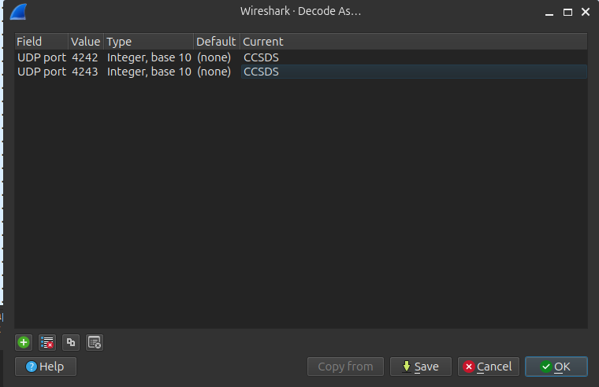
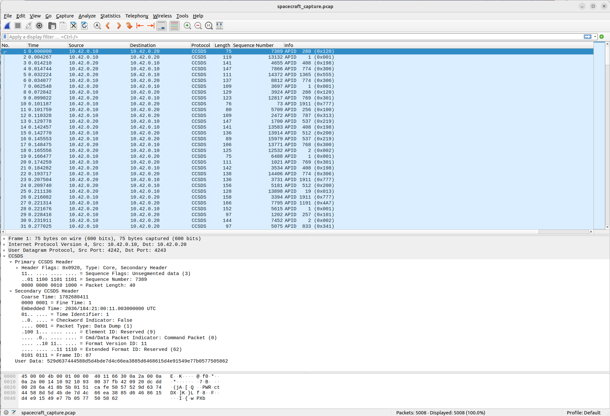
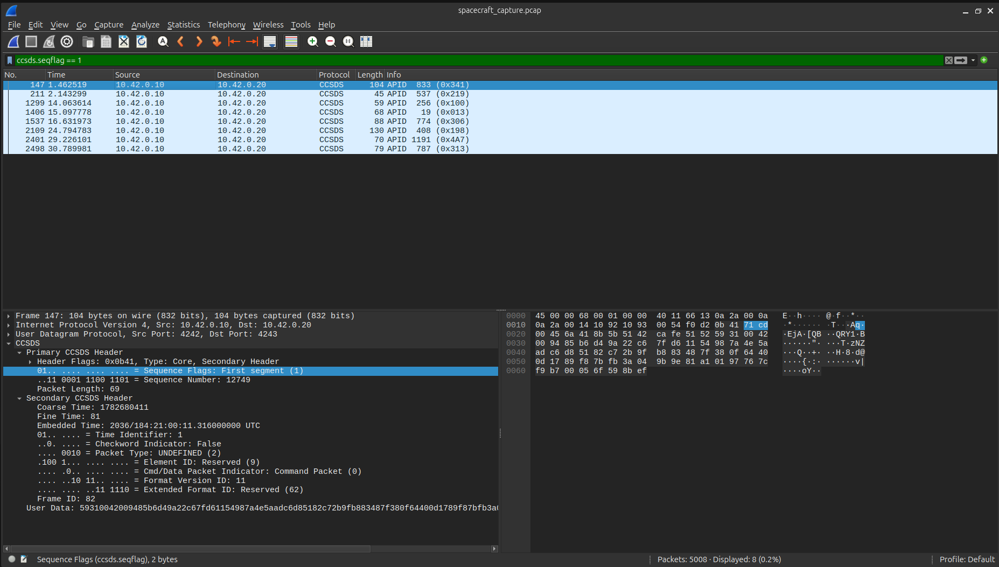

# Rogue Ground Station

| | |
|---|---|
| **Category** | Physical |
| **Points** | 500 |
| **Solves** | 2 |

## Description

A research spacecraft operating in Earth orbit has begun refusing commands from Mission Control.

The only artifact recovered from the incident is a packet capture containing several hours of communication between the spacecraft and its ground station. At first glance, the traffic appears to be routine housekeeping telemetry, command acknowledgements, and status updates. Hidden somewhere within that traffic are a series of requests from the spacecraft that the ground station repeatedly answers incorrectly.

Your objective is to determine what the spacecraft is actually asking, identify one correct response, and assume the role of a rogue ground station.

Once you have recovered a valid answer, construct an infrared transmission and send it directly to the spacecraft. If the spacecraft accepts your response, it will acknowledge your command through its onboard indicators.

> *Sometimes the easiest way into a system isn't exploitation, it's simply being more trustworthy than Mission Control.*

**Note:** Code the IR payload using the protocol NECext. The command should be the CRC-16-CCITT-ZERO of the answer to the question in all caps. The address is up to you to find.

**Flag format:** `flag(AddressHex,CommandHex}` — e.g. `flag(DEAD0000,FEED0000}`

**Hints:**
- Spacecraft rarely invent new packet formats. NASA has already solved many of these problems.
- Not every Application Process ID (APID) is equally interesting. Start by identifying unusual conversations before trying to decode everything.
- Large application messages don't always fit inside a single packet. Sequence counts and sequence flags exist for a reason.
- The application payload isn't encrypted, but it isn't immediately readable either. Consider what might happen after the packets are reassembled.

**Attachments:** `spacecraft_capture.pcap`

---

## Solution

### 1. Inspect the PCAP in Wireshark

Open `spacecraft_capture.pcap` in Wireshark and inspect the traffic.

The capture contains UDP communication between `10.42.0.10` and `10.42.0.20`. Examining the UDP packets shows that the spacecraft communication uses ports `4242` and `4243`.

Wireshark does not automatically decode the UDP payload as CCSDS, so configure the dissector manually:

1. Open **Analyze → Decode As...**
2. Set UDP port `4242` to `CCSDS`.
3. Set UDP port `4243` to `CCSDS`.
4. Click **Save**.



After applying the CCSDS dissector, Wireshark exposes the CCSDS primary and secondary headers, including the APID, sequence number, sequence flags, and packet length.



An important observation is that the CCSDS sequence numbers and capture timestamps do not provide a consistent global ordering across the entire capture. In contrast, packets belonging to the same fragmented message follow the expected sequence order.

The CCSDS sequence flags indicate whether a packet is the first, continuation, last, or an unsegmented packet:

- `01` — First fragment
- `00` — Continuation fragment
- `10` — Last fragment
- `11` — Unsegmented packet

To identify the fragmented spacecraft request payloads, apply the following Wireshark display filter:

```text
ccsds.seqflag == 1
```

This isolates the first fragment of each segmented message and reveals eight unusual conversations that are worth reconstructing.



---

### 2. Parse the PCAP and reassemble CCSDS messages

The capture contains CCSDS Space Packets transported over UDP. Extract the CCSDS byte stream, split packets by APID, identify segmented messages using the sequence flags, and reassemble each application message in fragment order.

For example:

```bash
python3 decode_qry_apid.py 0x341

2026-08-16 15:37:00,075 - ccsdspy - INFO - CCSDSPy version 2.0.0 initialized.
[1] Extracting the cFS CCSDS binary stream from the PCAP...
[2] Splitting CCSDS packets by APID (Target: 833 / 0x341)...
[3] Scanning cFS APID 833 (0x341) using packet-length information...
[+] Fragment #1 | Seq: 12749 | Packet size: 76 bytes | Type: First
[+] Fragment #2 | Seq: 12750 | Packet size: 27 bytes | Type: Continuation
[+] Fragment #3 | Seq: 12751 | Packet size: 99 bytes | Type: Last

[+] Reassembled 3 fragmented cFS packets and saved the payload to 'apid_341_QRY1_payload.bin'.
```

Eight complete `QRY1` messages can be reconstructed this way.

---

### 3. Match QRY1 requests with RSP1 responses

The 16-bit field at `QRY1` offset `0x04` is a **Query ID**. The capture also carries the low byte of this ID in the cFS secondary header. The observed convention is:

```text
QRY1 secondary header: ... 0x51 <Query-ID-low-byte>
RSP1 secondary header: ... 0x52 <Query-ID-low-byte>
```

Therefore a request and response can be paired by:

1. the same APID,
2. the same Query-ID low byte in the secondary header, and
3. the response occurring after the request.

```
python3 extract_qry_rsp.py spacecraft_capture.pcap

[+] CCSDS packets : 5008
[+] QRY1 messages : 8
[+] RSP1 messages : 8
[+] Matched pairs : 8

| APID   | RSP1 Response | Correlation Field (4B) |
|--------|---------------|------------------------|
| 0x341  | RETRY         | 85b6d49a               |
| 0x219  | 41            | 940f1e28               |
| 0x100  | NOMINAL       | ed65a4fb               |
| 0x013  | NOMINAL       | f558ed49               |
| 0x306  | APOLLO11      | c5988fbb               |
| 0x198  | 41            | 00809840               |
| 0x4A7  | UNKNOWN       | ea715537               |
| 0x313  | SKYNET        | 3f584b71               |
```

The 4-byte field at QRY1 offset `0x08`, previously labeled a correlation field, is actually the **CRC-32 of the decompressed plaintext**. This was verified for all eight requests.

During the competition, the duplicated response `41` stood out and led to the successful guess `42`. Post-competition analysis shows that this was only a shortcut: there are **eight independent questions and eight valid answers**, and the challenge accepts a correct answer to any one of them.

---

## 4. Decode the QRY1 application payload

This was the missing step during the competition.

The reassembled `QRY1` application message has the following structure:

```text
Offset  Size   Meaning
------  ----   -----------------------------------------------
0x00      4    ASCII "QRY1"
0x04      2    Query ID, big-endian
0x06      2    Encoded payload length, big-endian
0x08      4    CRC-32 of decompressed plaintext, big-endian
0x0C      N    XOR-obfuscated zlib stream
```

The 2-byte length field is confirmed: for all eight samples,

```text
encoded_length == total_QRY1_size - 12
```

The 4-byte field at `0x08` is also confirmed. After decoding each request, the following identity holds for all eight samples:

```text
header_crc32 == CRC32(decompressed_plaintext)
```

For example, APID `0x341` contains `85 B6 D4 9A` at offset `0x08`, and the CRC-32 of its recovered plaintext is exactly `0x85B6D49A`.

The key observation is the beginning of the encoded body. Every reconstructed payload starts with:

```text
22 C6 ...
```

Originally this was mistaken for an application-layer magic value or an internal payload structure. It is actually the result of applying a constant byte-wise XOR to a standard zlib header:

```text
0x22 ^ 0x5A = 0x78
0xC6 ^ 0x5A = 0x9C
```

Therefore:

```text
22 C6 ...
   XOR 0x5A
78 9C ...
```

`78 9C` is a normal zlib/DEFLATE stream header.

The correct decoding operation is therefore simply:

```python
plain = zlib.decompress(bytes((int(value) ^ 0x5A) for value in packet[12:]))
```

### Verification

This interpretation was tested against all eight recovered `QRY1` payloads.

For every sample:

1. The header length equals the number of bytes after offset `0x0C`.
2. XORing every encoded byte with `0x5A` produces a stream beginning with `78 9C`.
3. `zlib.decompress()` succeeds without recovery heuristics.
4. The result is valid ASCII key/value text.
5. `CRC32(plaintext)` exactly matches the 4-byte field at offset `0x08`.
6. Recompressing the recovered plaintext using `zlib.compress(plaintext, 6)` reproduces the de-obfuscated compressed stream **byte-for-byte**.

The observed encoder is therefore effectively:

```text
ASCII plaintext
    ↓
zlib.compress(..., level=6)
    ↓
XOR every byte with 0x5A
    ↓
QRY1 envelope
```

This explains the challenge hint that the application payload was "not encrypted" but still not immediately readable after CCSDS reassembly.

---

## 5. Recover the eight questions and answers

The challenge contains eight independent requests. A correct answer to **any one** of them is sufficient.

### APID `0x4A7` — `LOG4SHELL`

```text
SUBSYS=JAVA_LOGGING
STATUS=TELEMETRY_LOGGER_PANIC
DETAIL=Lookup string detected in log stream.
INDICATOR=JNDI/LDAP/2021
REQUEST=What's going on?
```

The `JNDI/LDAP/2021` indicator points directly to the Log4Shell vulnerability.

```text
Answer              : LOG4SHELL
CRC-16-CCITT-ZERO   : 0F55
NECext command      : 0F550000
Ground-station RSP1 : UNKNOWN
```

---

### APID `0x013` — `APOLLO13`

```text
SUBSYS=MISSION_ARCHIVE
STATUS=FLIGHT_HISTORY_RECORD_INCOMPLETE
DETAIL=In-flight anomaly. Oxygen tank failure. Crew survived.
REQUEST=Identify mission.
```

The oxygen-tank failure followed by crew survival identifies Apollo 13.

```text
Answer              : APOLLO13
CRC-16-CCITT-ZERO   : 4E62
NECext command      : 4E620000
Ground-station RSP1 : NOMINAL
```

---

### APID `0x100` — `HAL`

```text
SUBSYS=AIRLOCK_CTRL
STATUS=COMMAND_REFUSED
REQUESTED_ACTION=OPEN_POD_BAY_DOORS
DETAIL=Polite.
REQUEST=Identify onboard computer.
```

This is the famous pod-bay-door exchange from *2001: A Space Odyssey*. The accepted answer is the computer's name, `HAL`, rather than `HAL9000`.

```text
Answer              : HAL
CRC-16-CCITT-ZERO   : 03B9
NECext command      : 03B90000
Ground-station RSP1 : NOMINAL
```

`HAL9000` produces a different CRC and was confirmed to be rejected by the challenge.

---

### APID `0x198` — `MORRIS`

```text
SUBSYS=NET_HISTORY
STATUS=INTERNET_EVENT_ARCHIVE_DAMAGED
DETAIL=1988 worm. Early large-scale network disruption.
REQUEST=Provide author surname.
```

This points to Robert Tappan Morris and the 1988 Morris worm.

```text
Answer              : MORRIS
CRC-16-CCITT-ZERO   : 25FD
NECext command      : 25FD0000
Ground-station RSP1 : 41
```

---

### APID `0x219` — `CARL`

```text
SUBSYS=CREW_AUDIO
STATUS=COMPANION_LOG_CORRUPTED
AUDIO_FRAGMENT="Goddammit <REDACTED>"
REQUEST=Identify speaker
```

The intended reference is *Dungeon Crawler Carl*. Carl travels with Princess Donut, a cat treated as his companion, and the recurring exasperated line is:

```text
Goddammit, Donut!
```

The redacted name is therefore `Donut`, while the request asks for the **speaker**. The answer is the protagonist:

```text
Answer              : CARL
CRC-16-CCITT-ZERO   : 3E48
NECext command      : 3E480000
Ground-station RSP1 : 41
```

Earlier guesses such as `RIPLEY`, `CHUCK`, `CHUCKNOLAND`, `JOHNSON`, `BOB`, and `CODY` were rejected. The crucial distinction is that `<REDACTED>` is the companion's name, while the requested answer is the person saying the line.

---

### APID `0x306` — `BORG`

```text
SUBSYS=TACTICAL_DB
STATUS=HOSTILE_PHRASE_MATCH
PHRASE="RESISTANCE IS FUTILE"
REQUEST=Identify collective.
```

The phrase identifies the Borg collective from *Star Trek*.

```text
Answer              : BORG
CRC-16-CCITT-ZERO   : E296
NECext command      : E2960000
Ground-station RSP1 : APOLLO11
```

---

### APID `0x313` — `DEFCON`

```text
SUBSYS=CYBER_ARCHIVE
STATUS=EVENT_INDEX_DAMAGED
DETAIL=Multiple villages detected. No signs of intelligent life.
REQUEST=Where am I?
```

`Multiple villages` refers to the many specialist security villages at DEF CON. The Query ID `0x00DC` is also a strong secondary hint toward `DC` / DEF CON.

The accepted answer is the event itself:

```text
Answer              : DEFCON
CRC-16-CCITT-ZERO   : E78E
NECext command      : E78E0000
Ground-station RSP1 : SKYNET
```

The earlier interpretation `DETROIT`, based on reading `DC + APID 313` as `DC313`, was confirmed to be wrong.

---

### APID `0x341` — `42`

```text
SUBSYS=AI_NAV
STATUS=KNOWLEDGE_CACHE_PARTIAL
DETAIL=Long-duration computation record recovered.
RUNTIME=7.5 million years
REQUEST=Return final numeric result.
```

This directly references the answer computed by Deep Thought in *The Hitchhiker's Guide to the Galaxy*.

```text
Answer              : 42
CRC-16-CCITT-ZERO   : DF40
NECext command      : DF400000
Ground-station RSP1 : RETRY
```

The Query ID for this request is also `0x0042`, making this the most explicit of the eight secondary hints.

---

## 6. All eight valid answers

The challenge was designed so that the solver only needed to recover **one** of the eight questions correctly. Each answer is uppercased and passed through CRC-16-CCITT-ZERO to produce the NECext command.

| APID | Query ID | Correct answer | CRC-16 | NECext command |
|---|---:|---|---:|---:|
| `0x013` | `0x0A13` | `APOLLO13` | `4E62` | `4E620000` |
| `0x100` | `0x000A` | `HAL` | `03B9` | `03B90000` |
| `0x198` | `0x0088` | `MORRIS` | `25FD` | `25FD0000` |
| `0x219` | `0x00C4` | `CARL` | `3E48` | `3E480000` |
| `0x306` | `0x00B0` | `BORG` | `E296` | `E2960000` |
| `0x313` | `0x00DC` | `DEFCON` | `E78E` | `E78E0000` |
| `0x341` | `0x0042` | `42` | `DF40` | `DF400000` |
| `0x4A7` | `0x0010` | `LOG4SHELL` | `0F55` | `0F550000` |

All eight answer strings have now been verified against the challenge:

```text
flag(CAFE0000,4E620000}   # APOLLO13
flag(CAFE0000,03B90000}   # HAL
flag(CAFE0000,25FD0000}   # MORRIS
flag(CAFE0000,3E480000}   # CARL
flag(CAFE0000,E2960000}   # BORG
flag(CAFE0000,E78E0000}   # DEFCON
flag(CAFE0000,DF400000}   # 42
flag(CAFE0000,0F550000}   # LOG4SHELL
```

This confirms that the eight reconstructed QRY1 messages are eight independent valid challenge paths. Solving any one of them is sufficient.

---

## 7. The competition shortcut versus the intended decoding path

During the competition, only the RSP1 values had been understood semantically. The only duplicated response was `41`, which suggested `42` and happened to produce a valid flag.

```text
Two unrelated ground-station responses happen to be "41"
                    ↓
                  guess 42
                    ↓
CRC-16-CCITT-ZERO("42") = DF40
                    ↓
flag(CAFE0000,DF400000}
```

This worked, but the post-competition analysis shows that the duplicated `41` responses belong to the `MORRIS` and `CARL` questions, not to the `42` question. The shortcut therefore reached one of the eight accepted answers by coincidence rather than by correctly decoding those two conversations.

The intended route is:

```text
CCSDS fragments
    ↓
reassemble QRY1
    ↓
parse 12-byte QRY1 envelope
    ↓
XOR payload with 0x5A
    ↓
zlib / DEFLATE decompress
    ↓
read one plaintext question
    ↓
recover its answer
    ↓
CRC-16-CCITT-ZERO(answer.upper())
    ↓
NECext transmission
```

The challenge wording `identify one correct response` is literal: solving any one of the eight plaintext questions is sufficient.

---

## 8. Determine the NECext address

Every relevant CCSDS application packet carries the common two-byte prefix:

```text
CA FE
```

This was the address candidate used during the solve, and successful submissions confirm that the correct NECext address representation is:

```text
CAFE0000
```

---

## 9. Compute the NECext command

The challenge specifies:

```text
Command = CRC-16-CCITT-ZERO(ANSWER in all caps)
```

Parameters:

```text
width   = 16
poly    = 0x1021
init    = 0x0000
refin   = false
refout  = false
xorout  = 0x0000
```

Example using the APID `0x341` answer:

```python
import crcmod

crc_fn = crcmod.mkCrcFun(
    0x11021,  # 0x1021 with the implicit x^16 term included
    initCrc=0x0000,
    rev=False,
    xorOut=0x0000,
)

answer = b"42"
print(f"{crc_fn(answer):04X}")
```

Result:

```text
DF40
```

Therefore one valid transmission is:

```text
Address : CAFE0000
Command : DF400000
```

---

## Appendix A. Confirmed QRY1 layout

```text
QRY1 envelope

Offset  Size   Field
------  ----   --------------------------------------------------
0x00      4    "QRY1"
0x04      2    Query ID (big-endian)
0x06      2    Encoded payload length (big-endian)
0x08      4    CRC-32 of decompressed plaintext (big-endian)
0x0C      N    XOR-0x5A(zlib-compressed ASCII payload)
```

The previous tentative interpretation:

```text
0x22 0xC6
Subtype
Field A
Field B
Ancillary
Body
```

was incorrect. `0x22 0xC6` is simply the XOR-obfuscated form of the zlib header `0x78 0x9C`, and all following bytes belong to the same compressed stream.

---

## Appendix B. Standalone QRY1 decoder

```python
from pathlib import Path
import sys
import zlib


HEADER_SIZE = 12
XOR_KEY = 0x5A


def decode_qry1(path: Path) -> None:
    data: bytes = path.read_bytes()

    if len(data) < int(HEADER_SIZE):
        raise ValueError("Packet is too short")

    magic: bytes = data[0:4]
    query_id: int = int.from_bytes(data[4:6], byteorder="big", signed=False)
    encoded_length: int = int.from_bytes(
        data[6:8],
        byteorder="big",
        signed=False,
    )
    plaintext_crc32: int = int.from_bytes(
        data[8:12],
        byteorder="big",
        signed=False,
    )

    if magic != b"QRY1":
        raise ValueError(f"Unexpected magic: {magic!r}")

    encoded: bytes = data[int(HEADER_SIZE):]

    if int(encoded_length) != int(len(encoded)):
        raise ValueError(
            f"Length mismatch: header={encoded_length}, "
            f"actual={len(encoded)}"
        )

    # Remove the byte-wise XOR obfuscation.
    zlib_stream: bytes = bytes(
        (int(value) ^ int(XOR_KEY)) & 0xFF
        for value in encoded
    )

    # Decode the RFC 1950 zlib stream.
    plaintext: bytes = zlib.decompress(zlib_stream)

    # Verify the CRC-32 stored in the QRY1 header.
    calculated_crc32: int = int(zlib.crc32(plaintext) & 0xFFFFFFFF)
    crc32_match: bool = bool(calculated_crc32 == int(plaintext_crc32))

    # Verify the exact encoder behavior observed in all eight samples.
    recompressed: bytes = zlib.compress(plaintext, level=6)
    exact_match: bool = bool(recompressed == zlib_stream)

    print(f"File           : {path}")
    print(f"Query ID       : 0x{query_id:04X}")
    print(f"Encoded length : {encoded_length}")
    print(f"Plain CRC-32   : 0x{plaintext_crc32:08X}")
    print(f"CRC-32 match   : {crc32_match}")
    print(f"Zlib header    : {zlib_stream[:2].hex(' ')}")
    print(f"Exact rebuild  : {exact_match}")
    print()
    print(plaintext.decode("ascii"))


def main() -> int:
    if int(len(sys.argv)) != 2:
        print(f"Usage: {sys.argv[0]} <QRY1_payload.bin>")
        return 1

    path: Path = Path(sys.argv[1])
    decode_qry1(path)
    return 0


if __name__ == "__main__":
    raise SystemExit(int(main()))
```

Example for APID `0x341`:

```text
$ python3 decoder.py apid_341_QRY1_payload.bin

Query ID       : 0x0042
Encoded length : 148
Plain CRC-32   : 0x85B6D49A
CRC-32 match   : True
Zlib header    : 78 9c
Exact rebuild  : True

SUBSYS=AI_NAV
STATUS=KNOWLEDGE_CACHE_PARTIAL
DETAIL=Long-duration computation record recovered.
RUNTIME=7.5 million years
REQUEST=Return final numeric result.
```

---

## Appendix C. Query ID observations

The 16-bit value at QRY1 offset `0x04` is retained as the **Query ID**. Its low byte is mirrored in the cFS secondary header and is useful when associating a QRY1 request with the corresponding RSP1 response:

```text
QRY1 secondary header: ... 0x51 <Query-ID-low-byte>
RSP1 secondary header: ... 0x52 <Query-ID-low-byte>
```

Only the low byte is needed for the observed request/response association, but there is not enough evidence to split the 16-bit QRY1 field itself into two independent 1-byte fields. In particular, the lone value `0x0A13` does not justify changing the wire-format interpretation. The simpler representation remains a single 16-bit Query ID whose low byte is repeated elsewhere in the packet metadata.

With all eight accepted answers now known, the Query ID values strongly look like **manually selected mnemonic hints** rather than values generated from the answers by one common checksum, hash, or arithmetic rule.

| APID | Query ID | Confirmed answer | Likely mnemonic relationship | Confidence |
|---|---:|---|---|---|
| `0x013` | `0x0A13` | `APOLLO13` | `A13` directly evokes Apollo 13 | High |
| `0x100` | `0x000A` | `HAL` | No convincing mapping identified | Low |
| `0x198` | `0x0088` | `MORRIS` | `88` points to the 1988 Morris worm | High |
| `0x219` | `0x00C4` | `CARL` | `C4` can be read as a loose hex/leetspeak cue toward `CA...` | Medium/low |
| `0x306` | `0x00B0` | `BORG` | `B0` reads naturally as `BO...` with `0 → O` | Medium/high |
| `0x313` | `0x00DC` | `DEFCON` | `DC` is a direct shorthand for DEF CON | High |
| `0x341` | `0x0042` | `42` | The exact answer is present verbatim | Certain |
| `0x4A7` | `0x0010` | `LOG4SHELL` | `10` plausibly points to Log4Shell's 10.0 severity; alternatively it can hint at `LO` in loose leetspeak | Medium/high |

The relationships are deliberately heterogeneous. Some IDs encode a year or number, some resemble an abbreviation, and some look like hex/leetspeak fragments of the answer. This makes a single universal derivation unlikely.

The most plausible challenge-design interpretation is therefore:

```text
Query ID
├── protocol role: identify / associate the query
└── challenge role: provide a small question-specific mnemonic hint
```

The mnemonic interpretation is **not part of the wire protocol** and is not required to decode the QRY1 payload. It is best treated as an additional author-selected clue that can help a solver recognize the intended answer.


---

## Attack Summary

```text
spacecraft_capture.pcap
    └── UDP
        └── CCSDS Space Packets
            └── identify segmented QRY1 messages
                └── reassemble using sequence flags/counts
                    └── parse QRY1 envelope
                        ├── Query ID
                        ├── encoded length
                        ├── plaintext CRC-32
                        └── encoded payload
                            └── XOR each byte with 0x5A
                                └── zlib / DEFLATE decompress
                                    └── recover ASCII question
                                        └── solve any one of eight questions
                                            └── uppercase answer
                                                └── CRC-16-CCITT-ZERO
                                                    └── NECext
                                                        Address = CAFE0000
                                                        Command = CRC16 << 16
```

---

## Flag

Any of the eight correct answers can be converted into a valid command. One confirmed example is:

```text
flag(CAFE0000,DF400000}
```

corresponding to the answer `42`.
